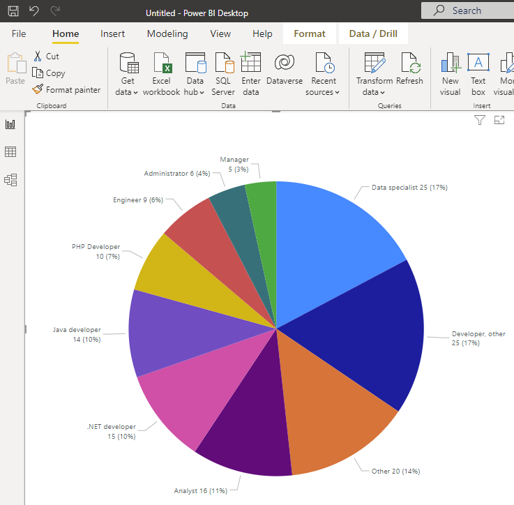
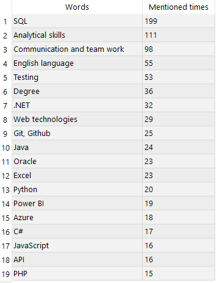
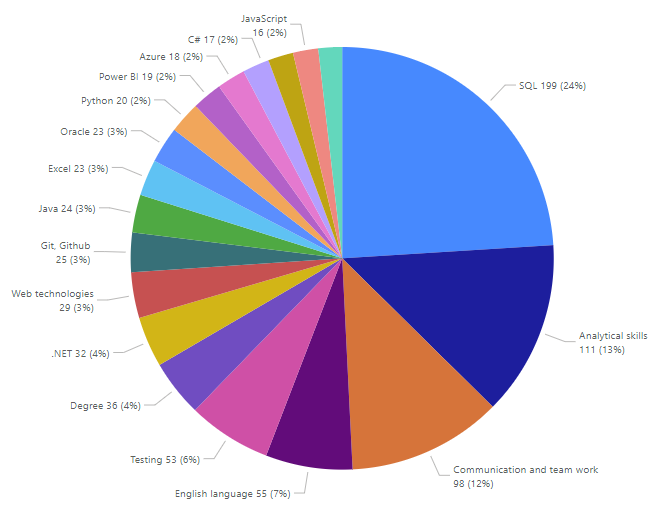
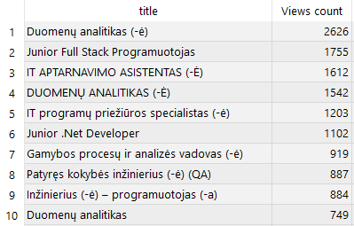

## My first SQL project

Since I started learning SQL I was interested how popular it is in job listings:

1.	I searched for SQL keyword in CVbankas.lt page, got 145 listings.
2.	Scraped results.
3.	Cleaned and analysed data with SQL.
4.	Used Power BI to visualize results.

To scrape search results I used Web Scraper - Free Web Scraping Chrome extension. Exported results in CSV format. Created PostgresSQL data base using Valentina Studio and imported CSV. Backed up data base with Create dump.

For next project it would be nice to create own Python script to performed customized scraping and get a cleaner data, automate load to SQL.

I analysed data with SQL. Only 4 job titles contained SQL, so I arranged job titles in to 10 categories:

Then I imported query results to Power BI and visualized them. For next project I would like to setup server level connection between SQL and Power BI.

Main issues I faced: mix of upper and lower case letters, different wording for same job positions, two languages (EN, LT), different punctuations.

Looks like there are only few positions where main requirement is SQL expertise, but good news is that SQL is a necessary and important supplementary tool in many broad fields.

I was interested what other tools and skills are used together with SQL, so I looked at scraped job requirements. It was difficult to find out what are common requirements when many job listing have huge requirements lists. I extracted all words (9566 total, 3069 unique) from requirements lists and summarized most common ones:

I also checked which job listings where most popular.

Could scrape additional data that includes information on how long the listing was available. Then it would be possible to present relative and more accurate data in last table.
