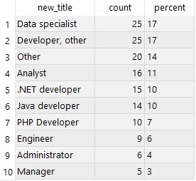

## My first SQL project

Since I started learning SQL I was interested how popular it is in job listings:
1.	I searched for SQL keyword in CVbankas.lt page, got 145 listings.
2.	Scraped results.
3.	Cleaned and analysed data with SQL.
4.	Used Power BI to visualize results.

To scrape search results I used Web Scraper - Free Web Scraping Chrome extension. For next project it would be nice to create own Python script to performed customized scraping and get a cleaner data, automate load to SQL.

I analysed data with SQL. Only 4 job titles contained SQL, so I arranged job titles in to 10 categories:

